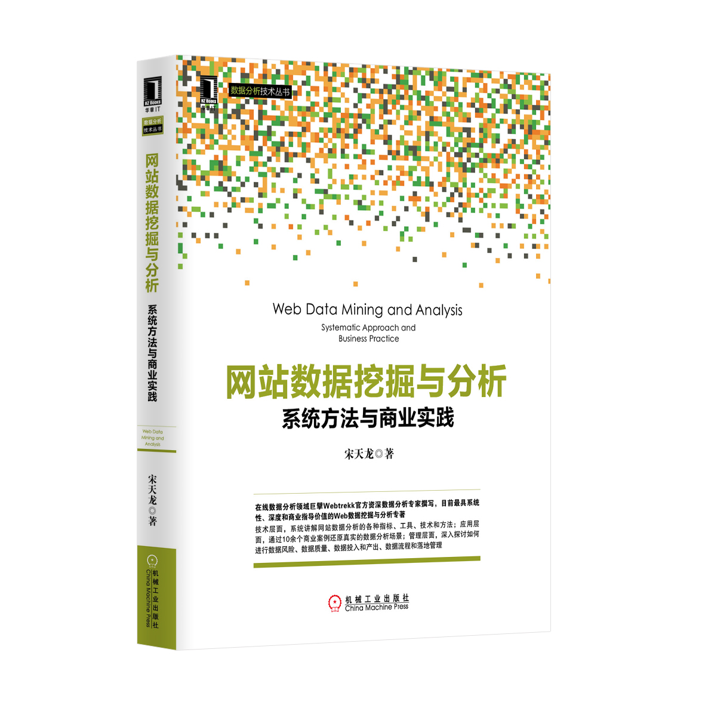

# [书籍]网站数据挖掘与分析

## 📖 前言与简介

### 为什么要写这本书

随着中国商业精细化运营价值的凸显以及企业对数据价值认可度的提高，网站数据分析正变得炙手可热，尤其在互联网企业中，网站数据分析已经成为一个必备的职业技能。

但在网站数据工作过程中，我发现企业中普遍存在的三类问题，本书就致力于帮助读者解决这三类问题。

第一类是数据工作者的认知问题

纵观当前网站数据相关的从业者，或多或少都会存在以下两种认知：第一种是技术论，这种观点的核心是关注数据部署和采集，数据工具、技术、模型的重要性而忽略了应用场景。第二种是业务论，这种观点只关注应用层面的业务问题，由于缺乏对数据前端处理的把握和专业技术、工具的支持，导致后期数据质量和应用都缺乏可靠性依据，最终也影响了数据价值的提炼及应用效果的提升。

以数据价值为导向的数据分析师应该具备以下素质，这也是在本书中贯穿的一个核心思想：

一是立足于数据本身的追本溯源。数据分析师需要了解数据的整个工作链条，从数据产生、采集、存储、提取、挖掘、分析、展现到集成应用，并能在各个环节有独到见解。

二是着眼于数据应用价值的研究。数据如何更智能化、可视化、自动化、更有价值的解决业务问题并带来业务价值的直接提升。

不得不说，技术是实现商业理解的必要保证。网站数据分析的传统方法是趋势、细分和转化，但仅有这些方法还不够，很多深层次的问题你需要借助其他方法来实现，例如数据挖掘、统计学、人工智能、商业智能等。我从来不认为网站数据分析是割裂的，它是数据工作的一部分，所有关于数据的工作方法都可以和网站数据结合使用。但可惜的是，当前将网站分析与其他数据工作方法的结合较少，因此，我在此书中用大量篇幅介绍数据挖掘在网站分析中的应用案例。

第二类是数据价值认知问题

对于任何一个企业来说，数据工作都不是企业发展的必须条件，最起码在企业初期没有数据的情况下企业同样可以快速发展。这使我来思考数据的价值到底是什么，数据到底能给企业带来什么，如何没有数据企业又会损失什么。归根结底，数据存在的意义是用来解决商业问题，换句话说数据能给企业带来多少价值，这些价值如何体现在企业利润报表里面？作为网站数据分析应该如何带动业务成长，或者如何单独的形态以业务的依存关系形成自我的价值体现？这些问题是需要讨论的，未来，数据的作用将更主要的着眼于基于数据驱动和系统智能工作机制，而辅助决策工作将成为数据的一个非主要应用而已。所以本书中的应用篇中重点介绍了基于数据驱动的营销和运营应用，目的便在于此。

第三类是如何从企业角度做数据工作管理的问题

作为初、中级分析师的主要工作职责是把数据本身或数据项目工作做好，但作为走向管理层的高级分析师或管理者来讲，需要思考的工作不仅是如何完成工作，而是如何建立企业数据架构、数据工作流程、数据应用体系、数据风险与以及质量管理体系，这是站在企业的高度来思考数据的定位及布局的必经之路。

基于以上几个方面，我萌生了写这本书的想法，目的是希望读者能够放开眼界，首先破除网站数据的局限，其次破除数据的局限，最终的落地点是站在企业的角度思考问题。作为一本接地气的书，我在书中列举了大量案例并通过每一步的详细介绍来帮助读者进行案例式学习，希望带给读者一些新的理解、观念和应用思路，无论在工作机会上还是收入上都能快速获得进一步的提升。

### 读者对象

本书适合以下几类从业者阅读：

对数据感兴趣的其他在职人员。无论你从事什么工作，如果你能够将数据的思路、价值和应用方法结合到你的工作实践中，一定会对你现有的工作有所帮助。数据化思维和工作能力已经成为每个在职人员的加分项。

刚入数据行业的新人。如果你是一位刚入行的新人，一定希望能够有一本兼具实战和理论高度的书籍从全局到局部的每个细节为你理清工作思路并明确职业成长方向。如果你要了解数据在企业内的价值、工作流程并想快速融入企业工作中并让得到领导的赏识，那么本书绝对适合你。

已经具备一定实践经验的数据从业者。对于已经在数据方面工作1~3年左右的从业者，相信你们已经面临了一些瓶颈，想要在原有的数据思维基础上获得更有效的工作方法和工作价值提升。本书中的丰富的应用案例可以帮助你拨开云雾见青天。

已经具有丰富工作经验的书籍从业者。当数据从业者工作3年或3年以上时，就已经有机会从执行层走向管理层。机会总是留给准备好的人们，作为管理者如何从数据工作流程、制度、风险和绩效进行思考并开展工作？相信本书会给你满意的答案。

### 如何阅读本书

本书的正文内容分为四部分，按照数据工作的成长思路来撰写，每个部分都对应着一个成长阶段。

第一部分为认知篇，介绍网站数据分析在企业内的价值体以及如何建立个人的数据成长规划、企业的数据架构与定位。本篇的目的是帮助读者快速了解企业内部的整体数据架构、网站数据分析所扮演的角色以及个人如何进行自我定位和发展。

第二部分为准备篇，分别介绍了网站数据的采集配置、网站分析工具选择、网站数据整合方法、监测评估指标以及应用场景和方法。这些知识是进行数据分析的基本前提，同时其中的监测评估指标和应用场景方法这两章直接以业务场景为切入点，知识可直接应用到工作实践中。

第三部分为应用篇，以与网站分析结合最为紧密的营销和网站运营为例，分别介绍了网站数据的辅助决策以及数据驱动工作内容，通过10多个案例还原数据分析的实际场景，这些案例可以套用到工作中并直接产出效果。

第四部分为提高篇，从数据管理者和领导者的角度思考如何进行数据风险、数据质量、数据投入和产出、数据流程和落地管理，这些都是作为管理者自我提升的必备知识。

除正文内容外，本书还针对网站分析提供了两部分附录：

附录A是关于网站分析工具三个典型工具特性的具体介绍。其中A1提供了网站数据分析中两个典型工具的功能列表（默认报表和指标），以方便读者了解世界级工具的完整特性，这些工具由于其付费的封闭性导致大多数国内读者都没有机会接触（其他工具在本书第五章有概要介绍）。他们是Webtrekk（主要是Q3）和Adobe Analytics（主要是Sitecatalyst）。A2提供了最新的基于Universal Analytics的完整代码部署示例，包括默认跟踪，常用的自定义跟踪设置如事件追踪、虚拟页面、社交互动、自定义页面名称、用户ID追踪、增强的链接归因、重命名全局变量、受众特征和兴趣追踪、普通电子商务追踪以及最新更新的增强的电子商务追踪。

附录B总结了关于网站数据工作的局限性和发展，从网站数据面临的价值、认知和技术局限性来阐述面临的挑战，展望了未来数据发展的四个方向：整合化、智能化、可视化、移动化。

同时，本书在应用篇中的数据分析和数据挖掘案例都提供了原始数据作为附件下载，还提供了渠道效果聚类流、网站重合度关联分析两个数据挖掘模型，读者可直接利用原始数据自行进行细节研究。

### 勘误和支持

由于作者的水平有限以及编写时间的仓促，书中难免会出现一些错误或者不准确的地方，恳请读者批评指正。为此，作者特意创建一个QQ群以方便大家讨论与沟通（群号：127586352），读者可以将书中的错误发布群中；同时如果你遇到任何问题，也可以访问http://www.searchmarketingart.com/并在“书籍讨论区”提问，我将尽量在线上为读者提供最满意的解答。书中的全部源文件除可以从华章网站下载外，还可以从这个网站“书籍讨论区”下载，我也会将相应的功能更新及时更正出来。如果你有更多的宝贵意见，也欢迎发送邮件至邮箱beijingtl@gmail.com，期待能够得到你们的真挚反馈。

### 致谢

首先要感谢机械工业出版社华章公司的总编辑杨福川老师，是他鼓励我写这本书并给予了详细的思路拓展和专业指导工作，其次感谢全程参与审核、校验等工作的姜影编辑以及其他支持本书出版的相关工作者。

感谢我的领导彭亮以及我的良师益友田学峰，是他们在我的职业生涯中给我非常多的启发以及知识拓展的机会，我工作过程中接触到的各个世界级的网站数据解决方案以及数据工作经验都是基于已有的宝贵工作经历。另外，在从网站数据到企业级数据的角色转变过程中，感谢我的好朋友、好同事的共同努力，所以才会有非常多关于企业级数据价值的高度产出，他们是姜继浩、庞程程、吕兆星、赵光娟、郑传峰等。另外，还有很多一起奋斗过的小伙伴如徐子东、陈林、郭靖等在此就不一一列举，同样感谢他们对我工作的支持。

感谢我的领导Webtrekk亚太区总监张姝，是她给了我更多学习世界级网站数字智能解决方案的机会并支持我撰写关于Webtrekk的相关内容。

最后感谢我的爸爸、妈妈将我培养成人，并交给我正确做人、做事的方法！感谢我的夫人，是她在我写作的时间里默默支持家里的一切事务，使我有精力、有时间完成此书的全部撰写工作。

谨以此书献给我最亲爱的家人，以及众多热爱数据工作并努力为之奋斗的朋友们！

宋天龙（Tony Song）

2014年9月于中国北京 

## 📑 目录
- 前言
- 第1章 第一篇 认知篇
- 第1章 第1章 科学认识网站数据分析
- 1.1 企业为什么要对网站数据进行分析
- 1.1.1 网站数据分析能为“谁”解决问题
- 1.1.2 网站数据分析能解决哪些问题
- 1.1.3 常见的几种“分析”概念
- 1.2 网站数据分析的5个误区
- 1.3 识别网站数据欺骗的3种形态
- 1.4 辅助决策与数据驱动的争议
- 1.4.1 辅助决策
- 1.4.2 数据驱动
- 1.4.3 辅助决策与数据驱动差异点
- 1.5 本章小结
- 第2章 第2章 从零开始建立企业数据体系
- 2.1 数据价值最大化的定位
- 2.1.1 数据价值定位的基本原则
- 2.1.2 数据价值的4种常见定位
- 2.2 企业数据职能架构与组成
- 2.2.1 企业内部职能架构
- 2.2.2 企业外部职能架构
- 2.3 企业数据技术架构与组成
- 2.3.1 数据收集层
- 2.3.2 数据存储层
- 2.3.3 数据计算层
- 2.3.4 数据管理层
- 2.3.5 数据应用层
- 2.4 本章小结
- 第3章 第3章 从零开始建立数据分析师个人成长体系
- 3.1 数据分析师的完整知识结构
- 3.2 数据分析师的职能素质要求
- 3.2.1 工作方向划分
- 3.2.2 工作职位划分
- 3.3 数据分析师成长的四个阶段
- 3.4 给数据分析师的5点建议
- 3.5 本章小结
- 第4章 第二篇 基础篇
- 第4章 第4章 网站数据采集和配置
- 4.1 网站分析系统数据工作机制
- 4.1.1 数据采集
- 4.1.2 数据处理
- 4.1.3 数据报告
- 4.2 网站代码部署
- 4.2.1 通用全局脚本部署
- 4.2.2 通用页面脚本部署
- 4.2.3 特定页面脚本部署
- 4.3 系统功能配置
- 4.3.1 数据安全设置
- 4.3.2 数据处理设置
- 4.3.3 数据转化设置
- 4.3.4 数据整合设置
- 4.3.5 数据智能工作
- 4.4 本章小结
- 第5章 第5章 网站分析工具的选择
- 5.1 网站分析工具
- 5.1.1 Adobe Analytics
- 5.1.2 Webtrekk
- 5.1.3 Webtrends
- 5.1.4 Google Analytics
- 5.1.5 IBM Coremetrics
- 5.1.6 Piwik
- 5.1.7 百度统计
- 5.2 移动分析工具
- 5.2.1 Flurry
- 5.2.2 友盟
- 5.3 如何选择网站分析工具
- 5.3.1 整体解决方案能力
- 5.3.2 产品易用性
- 5.3.3 功能丰富性
- 5.3.4 增值服务价值
- 5.3.5 价格和费用
- 5.4 本章小结
- 第6章 第6章 网站数据整合的方法
- 6.1 网站数据整合的意义
- 6.2 网站数据整合的范畴
- 6.2.1 业务数据整合
- 6.2.2 IT数据整合
- 6.3 网站数据整合的方法
- 6.3.1 在线数据整合
- 6.3.2 本地数据整合
- 6.4 本章小结
- 第7章 第7章 数据监测与评估指标
- 7.1 业务效果流指标
- 7.1.1 站外推广类指标
- 7.1.2 网站运营类指标
- 7.1.3 企业会员类指标
- 7.1.4 呼叫中心类指标
- 7.1.5 仓储配送类指标
- 7.2 成本控制流指标
- 7.3 收益控制流指标
- 7.4 本章小结
- 第8章 第8章 数据分析场景和方法
- 8.1 以效果预测为目的的数据分析
- 8.1.1 效果预测是什么
- 8.1.2 效果预测的2种类型
- 8.1.3 效果预测的应用场景
- 8.1.4 预测结果的常用方法
- 8.2 以结论定义为目的的数据分析
- 8.2.1 结论定义是什么
- 8.2.2 结论定义的4种方向
- 8.2.3 结论定义的3个误区
- 8.2.4 下定结论的常用方法
- 8.3 以数据探究为目的的数据分析
- 8.3.1 数据探究是什么
- 8.3.2 数据探究的2种类型
- 8.3.3 探究原因的分析方法
- 8.4 以业务执行为目的的数据分析
- 8.4.1 业务执行是什么
- 8.4.2 业务执行的2种类型
- 8.4.3 提取业务执行建议的常用方法
- 8.5 正确的数据模型与算法选择观
- 8.6 本章小结
- 第9章 第三篇 案例篇
- 第9章 第9章 网站数据的营销辅助应用
- 9.1 网站营销分析辅助报告矩阵
- 9.2 三种常用的网站营销分析场景
- 9.2.1 营销前的媒体规划与效果预测
- 9.2.2 营销时的异常检测与及时反馈
- 9.2.3 营销后的结果总结与项目分析
- 9.3 常用的网站营销分析维度
- 9.3.1 目标端
- 9.3.2 媒体端
- 9.3.3 用户端
- 9.3.4 网站端
- 9.3.5 竞争端
- 9.3.6 其他因素
- 9.4 网站营销辅助决策四大案例
- 9.4.1 恶意流量分析
- 9.4.2 多渠道订单归因分析
- 9.4.3 渠道效果聚类
- 9.4.4 营销效果分析
- 9.5 本章小结
- 第10章 第10章 数据驱动下的数字营销应用
- 10.1 数字营销的概念和范围
- 10.2 数字营销发展的三个阶段
- 10.3 个性化媒体投放的价值
- 10.4 个性化媒体投放的架构
- 10.4.1 数据层
- 10.4.2 算法层
- 10.4.3 API层
- 10.4.4 应用层
- 10.5 个性化媒体投放的实现
- 10.5.1 个性化媒体投放的实现方式
- 10.5.2 如何选择优秀的服务提供商
- 10.6 个性化媒体投放的问题
- 10.7 本章小结
- 第11章 第11章 网站数据的运营辅助应用
- 11.1 网站运营分析辅助报告矩阵
- 11.2 三类常见的网站运营分析场景
- 11.2.1 点：面向单体坑位的辅助分析
- 11.2.2 线：面向站内流程的优化与提高
- 11.2.3 面：面向整体网站资源的价值最大化
- 11.3 常用的网站运营分析维度
- 11.3.1 目标端
- 11.3.2 运营端
- 11.3.3 用户端
- 11.3.4 网站端
- 11.3.5 竞争端
- 11.3.6 其他因素
- 11.4 网站运营辅助决策四大案例
- 11.4.1 站内广告位效果标杆管理
- 11.4.2 网站用户调研
- 11.4.3 站内活动分析
- 11.4.4 商品销售诊断
- 11.5 本章小结
- 第12章 第12章 数据驱动下的个性化运营应用
- 12.1 网站运营的概念和范围
- 12.2 网站运营发展的三种形态
- 12.3 个性化网站运营的价值
- 12.4 个性化网站运营的应用
- 12.4.1 在线个性化应用
- 12.4.2 离线个性化应用
- 12.5 个性化网站运营的实现
- 12.6 个性化网站运营遇到的问题
- 12.7 本章小结
- 第13章 第四篇 提高篇
- 第13章 第13章 数据风险管理与控制
- 13.1 数据风险管理的概念
- 13.2 数据风险管理的类型
- 13.3 数据风险管理的原则
- 13.4 数据风险管理与控制
- 13.5 本章小结
- 第14章 第14章 数据质量把控与建设
- 14.1 数据质量建设的内涵
- 14.2 数据质量建设的原则
- 14.3 影响数据质量常见因素
- 14.4 数据质量建设的框架
- 14.4.1 数据质量管理
- 14.4.2 数据监督管理
- 14.4.3 数据生命周期管理
- 14.5 本章小结
- 第15章 第15章 数据投入与产出管理
- 15.1 数据投入与产出的内涵
- 15.2 数据投入与产出的特征
- 15.3 数据投入与产出的管理
- 15.3.1 数据投入管理
- 15.3.2 数据产出管理
- 15.3.3 数据投入与产出优化
- 15.4 本章小结
- 第16章 第16章 数据流程与落地管理
- 16.1 数据流程与落地管理的内涵
- 16.2 数据流程与落地管理的意义
- 16.3 数据流程与落地管理的策略
- 16.4 数据流程与落地管理的框架
- 16.4.1 数据需求管理
- 16.4.2 项目工作流程
- 16.4.3 数据培训体系
- 16.4.4 权限管理流程
- 16.4.5 数据知识管理
- 16.5 本章小结
- 附录 A 网站分析工具的特性及代码部署
- 附录 B 企业网站数据工作的局限与发展

## 💻 配套资源与附件
- **随书附件**: 本仓库 `随书附件/` 目录下包含了书中所涉及的所有代码、数据文件和配图。
- **联系与勘误**: 如果您在学习过程中发现任何问题或需要交流，欢迎提交 Issue。
